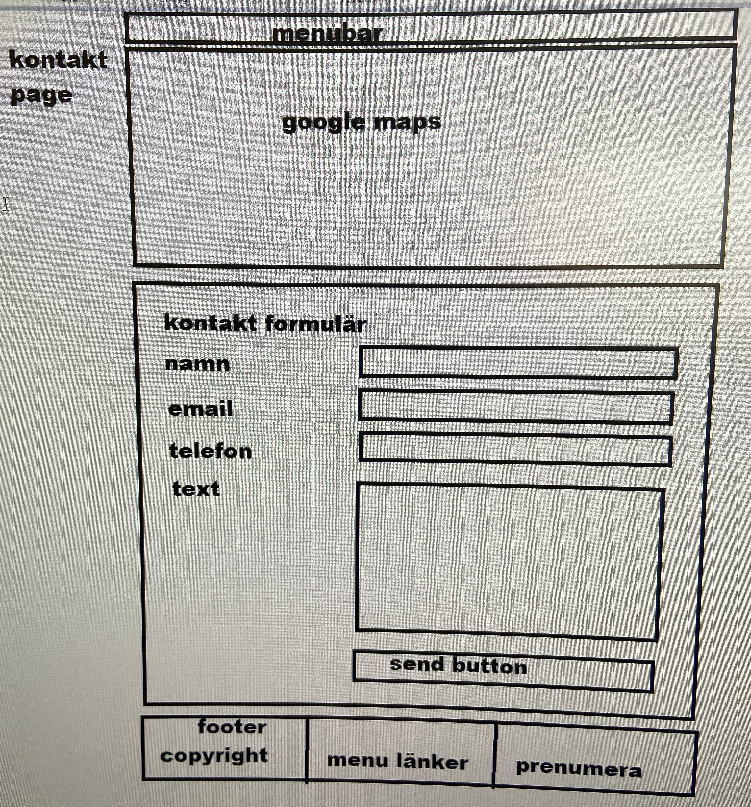
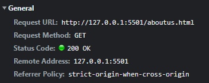
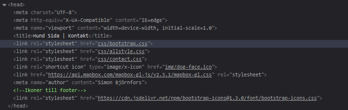
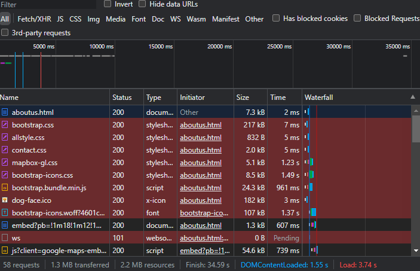

# Rapport html/css Simon

## Wireframe
Ritad av Shenol  

## Nyckelord / SEO
Vi valde nyckelorden Hundar + Halmstad. Då jag inte hade så mycket text på min sida (Kantaktsidan, ligger som aboutus.html då det blev lite förvirring när vi började projektet.) så lade jag endast in det som en rubrik "Hitta till våra hundar i halmstad" ovanför kartan. samt att halmstad står med i adressen.

## Hur webläsaren använder HTTP för att besöka din hemsida
webbläsaren skickar en HTTP GET request på url:n http://127.0.0.1:5501/aboutus.html till webbservern.  
  
webbservern svarar (respose) med stauskod 200 OK om allt är ok
och skickar html sidan.  
Om det finns länkar i tex `<head>` delan av htmlkoden som tex css stylesheets eller bilder någonstans i htmlkoden skickar webbläsaren en ny request för att hämta dessa.
  

  

##  Varför just den URL som används i HTTP anropet ovan används
http - innebär vilket schema/protokoll som används kan vara http/https eller tex ws, vilken typ av "språk" som används för att skicka och hämta data.  
127.0.0.1 - domän/auktoritet/server. 127.0.0.1 är en IP adress som refererar till något som finns på just den här datorn.  
5501 - Portnummer vilket program på datorn som vi ansluter till (blev antagligen 5501 istället för 5500 för at tjag glömde stänga en gammla live server innan jag startade en ny.)
/aboutus.html - Sökväg/resurs berättar var på webbservern filen vi vill ha tag i finns.

## Reflektion över valda lösningar
Shenol gjorde wireframen som jag använde och jag tyckte den var helt ok. Följde den ganska nära men gjorde en del förändringar som jag tyckte fungerade bätttre med en bredare skärm.  Jag använde ett formulär för kontakten vilket jag själv egentligen inte tycker om när jag ska kontakta företag utan föredrar hellre att jag bara får en mailadress som jag kan skicka till. Jag hade kunna göra det istället och använda mailto för att bara kunna klicka och öppna upp användarens mailprogram men det hade blivit betydligt mindre att göra på sidan om jag inte hade haft formuläret.  
Kartan hade jag först som en mapbox då jag hade hittat en tutorial för hur man kunde inkludera det. Jag ändrade det till google maps istället för att kunna ha en platsmarkering och google maps var lättre att bara lägga till som embeded och inte krävde några javascript.  
Jag förökte använda så mycket semantisk html som möjligt när jag skrev koden, och när jag började skrev jag bara allt med bootstrap klasser, vilket fungerade bra men gjorde också att jag inte hade skrivit någon egen css kod. Därför bytte jag formuläret till att inte använda bootstrap och använde det bara till footern istället.  
När jag skrev css koden provade jag att använda lite special tekniker för att inte behöva använda media queries t.ex. `    grid-template-columns: 
    repeat(auto-fit, minmax(20rem, 1fr));`  
    men det gick inte jättebra och jag fick köra med media queries iallafall. Jag hade också problem med att få footern att lägga sig längst ner även om det inte fanns tillräklit med content på sidan och den bråkade lite med mig och la sig över andra saker osv, men jag löste det genom att gen en min-height tii min .content klass `.content{
        min-height: 75vh;
    }` som ger content (som ligger i en section precis under main) en minsta höjd på 75% av fönstretshöjd och efter som footern ligger utanför den sektionen hamnar den under innehållet på sidan.
